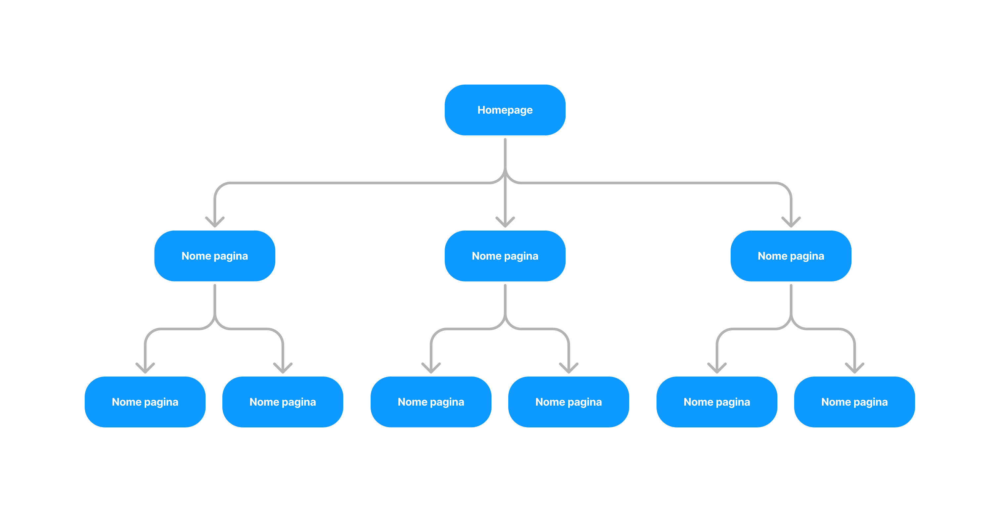

Architettura dell'informazione
*********************************
L’architettura dell’informazione consiste nell’**organizzazione dei contenuti negli ambienti informativi**, sia fisici che digitali, e serve a rendere i servizi pubblici più facili da trovare, da capire e da usare. 

Una buona architettura dell’informazione aiuta le persone a comprendere ciò che le circonda e a trovare ciò che cercano, sia online che offline. Lavorare su questo ambito implica fare delle riflessioni sulla struttura dell’informazione, sulla gerarchia dei contenuti e sul linguaggio. L’architettura dell’informazione è efficace se progettata sulla base dei bisogni delle persone, tenendo conto del contesto in cui il servizio si va a inserire e considerando l’organizzazione logica dei contenuti.

L’architettura dell’informazione può comprendere:
  
- l'**alberatura**, ovvero la posizione delle pagine nella struttura di un sito, o il flusso di navigazione, ovvero la sequenza in cui vengono presentati i contenuti in un flusso di interazione lineare (come la compilazione di una richiesta online); 
- i **sistemi di navigazione**, ovvero quegli elementi che aiutano le persone a capire dove si trovano e dove devono andare; 
- le **tipologie di contenuto**, in inglese **content type**, ovvero delle scalette di contenuti standardizzati per assicurare l'uniformità informativa; 
- le **ontologie**, ovvero le rappresentazioni formali di un dominio di conoscenza attraverso cui si può garantire l’interoperabilità e interscambio dei dati tra diversi ambienti digitali; 
- i **vocabolari controllati**, ovvero liste di vocaboli per facilitare la trovabilità delle informazioni da parte degli utenti.

.. admonition:: Risorse disponibili

   Il `kit Architettura dell'informazione <https://designers.italia.it/risorse-per-progettare/progettare/architettura-dell-informazione/>`_ di Designers Italia ti guida passo per passo nelle attività pratiche utili a progettare un'architettura efficace e intuitiva.

Definire l'architettura dell'informazione
=============================================

Uno dei principi dell’architettura dell’informazione è tenere conto del contesto e delle funzioni delle organizzazioni e dei servizi che esprimono. Questo significa che è possibile definire standard di architettura dell’informazione specifici per il mondo della Pubblica Amministrazione. In secondo luogo, sarà possibile avviare un’attività di modellazione più specifica, partendo da una segmentazione degli enti e delle funzioni ad esse associate.  

In pratica, l’organizzazione della conoscenza all’interno della Pubblica Amministrazione ha alcune regole generali che è bene conoscere e che devono essere utilizzate in ogni ambito; e alcune regole (standard) che si possono applicare all’interno di ambiti specifici. 

Per fare un esempio, è possibile definire uno standard per l’architettura dell’informazione dei Comuni italiani, senza che sia necessario affrontare il problema per ciascuno dei migliaia dei siti web dei Comuni italiani. 

.. admonition:: Risorse disponibili

   Se stai progettando un sito informativo per un **Comune**, una **scuola**, una **ASL** o un **museo civico**, sono già disponibili all'uso i `modelli di sito e servizi <https://designers.italia.it/modelli/>`_ di Designers Italia con alberature, content type e tassonomie. Puoi partire da questi modelli anche per progettare siti e servizi per altre tipologie di enti.

Alberatura
================

L'alberatura, nota anche come **struttura ad albero** o **sitemap**, è la **rappresentazione organizzativa dei contenuti di un sito web**. Si tratta di una mappa gerarchica che descrive come le varie pagine e sezioni di un sito sono interconnesse. Questa struttura è fondamentale per la navigazione degli utenti e per l'ottimizzazione dei motori di ricerca (SEO).  

L'alberatura segue una struttura gerarchica simile a un albero. La homepage è spesso vista come la radice, con rami che si estendono a sottosezioni e pagine più dettagliate. 

   *Esempio di struttura ad albero di un sito web.*

Una buona alberatura aiuta gli utenti a trovare facilmente le informazioni di cui hanno bisogno, riducendo il numero di clic necessari per raggiungere una pagina specifica.

La posizione di una pagina in alberatura influenzerà alcuni elementi chiave, come le breadcrumbs e le URL. Ad esempio, se nel sito di un Comune, la pagina dell’Ufficio Anagrafe è posizionata nella sezione “Amministrazione”, sotto la voce “Uffici””:

- le breadcrumbs della pagina saranno **Home / Amministrazione / Uffici / Ufficio Anagarafe**;
- l'URL della pagina sarà **https://www.nomecomune.provincia.it/amministrazione/uffici/ufficio-anagrafe**.

Progettare l'alberatura con il card sorting
---------------------------------------------

Per progettare un’alberatura che risponda ai bisogni degli utenti, è necessario prima `individuare i contenuti <https://designers.italia.it/risorse-per-progettare/progettare/architettura-dell-informazione/individua-i-contenuti/>`_ e successivamente organizzarli in categorie. 

Il card sorting è una tecnica che aiuta a **capire come gli utenti raggruppano e organizzano le informazioni**, fornendo preziosi input per la progettazione della struttura del sito e la disposizione dei contenuti. 

L'attività prevede che i partecipanti organizzino delle schede (cards), ognuna delle quali rappresenta un'unità di contenuto, in categorie che hanno senso per loro.  

Nel **card sorting aperto**, ai partecipanti viene chiesto di raggruppare le schede in categorie che creano loro stessi e di dare un nome a ciascuna categoria. Questo approccio è utile per scoprire come gli utenti vedono la struttura ideale del contenuto. 

Nel **card sorting chiuso**, ai partecipanti viene fornito un set di categorie predefinite e viene chiesto di classificare le schede all'interno di queste categorie. Questo è utile quando si vuole validare una struttura di contenuti esistente. 

Una volta completato il card sorting, i dati vengono raccolti e analizzati per identificare modelli di raggruppamento comuni. Le analisi possono rivelare categorie naturali, suggerire miglioramenti per i nomi delle categorie e mettere in luce eventuali discrepanze nell'organizzazione proposta.

.. admonition:: Risorse disponibili

   Nel kit Architettura dell'informazione di Designers Italia trovi strumenti utili a `svolgere un'attività di card sorting <https://designers.italia.it/risorse-per-progettare/progettare/architettura-dell-informazione/organizza-i-contenuti/>`_ e a `rappresentare graficamente un'alberatura <https://designers.italia.it/risorse-per-progettare/progettare/architettura-dell-informazione/definisci-alberatura-content-type-e-tassonomie/>`_.

Flussi di servizio
====================
Un altro caso di architettura dell’informazione sono i tipici flussi di fruizione dei servizi digitale. Al contrario di un sito web, i flussi di servizio non hanno una struttura ad albero, ma sono formati da una **serie di passaggi sequenziali**.

   *Rappresentazione del flusso di fruizione di un servizio digitale: percorso di navigazione e relazioni tra contenuti.*

Ogni passaggio presenterà i contenuti e le informazioni necessarie per poter andare avanti nel flusso. Un buon flusso di servizio non sovraccarica l’utente, ma scandisce le informazioni necessarie su più schermate, mostrandole solo quando sono necessarie all’utente. 

Per progettare i contenuti di un flusso di servizio in modo efficace, è fondamentale condurre una ricerca utente specifica che aiuti a comprendere i bisogni, i comportamenti e le aspettative degli utenti durante l'interazione con il servizio. Alcune attività di ricerca utili sono le interviste, sondaggi e questionari, mappatura dell’user journey e i test di usabilità. 

Una volta raccolte le necessità informative degli utenti, è utile schematizzare i risultati usando i content wireframe. I content wireframe sono rappresentazioni schematiche, semplificate e visive di una pagina web o di un'interfaccia digitale, focalizzate sull'organizzazione e disposizione dei contenuti piuttosto che sul design grafico o sull'estetica.

.. admonition:: Risorse disponibili

   Il `kit Processi e servizi <https://designers.italia.it/risorse-per-progettare/progettare/processi-e-servizi/>`_ di Designers Italia ti aiuta a progettare e rappresentare i flussi di servizio di processi sequenziali. Se stai progettando servizi digitali per un Comune, sono già disponibili all'uso i flussi di servizio e le interfacce per i `principali servizi comunali <https://designers.italia.it/modelli/comuni/adotta-il-modello-di-servizi-digitali-comunali/>`_ nel modello Comuni di Designers Italia.

Sistemi di navigazione
=============================

I sistemi di navigazione di un sito o servizio digitale sono le **strutture e gli elementi che guidano gli utenti attraverso i contenuti e le funzionalità** disponibili. Questi sistemi sono fondamentali per garantire un'esperienza utente fluida e intuitiva, permettendo agli utenti di trovare rapidamente le informazioni o le funzionalità che cercano. 

**Navigazione principale (o globale)**

È la barra di navigazione principale che di solito si trova nella parte superiore del sito (`header <https://designers.italia.it/design-system/componenti/header/>`_) o in un menu laterale. Fornisce accesso alle sezioni principali del sito o servizio. Garantisce che l'utente possa accedere rapidamente alle aree chiave del sito da qualsiasi pagina.  

**Navigazione secondaria (o locale)**

È la navigazione che si trova all'interno di una sezione specifica del sito, fornendo accesso alle sottosezioni o ai contenuti correlati. Aiuta gli utenti a esplorare contenuti correlati senza dover tornare alla navigazione principale. Graficamente è generalmente rappresentata da un `megamenu <https://designers.italia.it/design-system/componenti/megamenu/>`_. 

**Navigazione contestuale**

Avviene direttamente all'interno del contenuto, tramite link o elementi di navigazione che guidano l'utente verso contenuti correlati o approfondimenti: link nel testo, `pulsanti <https://designers.italia.it/design-system/componenti/buttons/>`_ *"Scopri di più" / “Vai a...”*, `card <https://designers.italia.it/design-system/componenti/card/>`_, `carousel <https://designers.italia.it/design-system/componenti/carousel/>`_. 

**Breadcrumb**

Indicatori di un percorso di navigazione gerarchico che aiuta gli utenti a comprendere la loro posizione all'interno di un sito e a tornare facilmente ai livelli precedenti. Le `breadcrumb <https://designers.italia.it/design-system/componenti/breadcrumbs/>`_ sono poste a inizio pagina e rispecchiano l’alberatura del sito. Ad esempio, nella pagina dedicata all’ufficio anagrafe di un sito web di un Comune potremmo trovare le breadcrumb *Home / Amministrazione / Uffici / Ufficio anagrafe*. 

**Navigazione a step**

Tipica di un flusso di servizio, la navigazione a step è usata in applicazioni e siti web per guidare gli utenti attraverso una sequenza di passaggi o fasi, in modo strutturato e lineare. Ogni passaggio rappresenta una fase specifica di un processo complesso, come la registrazione a un servizio, la compilazione di un modulo o il completamento di un pagamento. Viene generalmente resa a livello grafico con degli `stepper <https://designers.italia.it/design-system/componenti/steppers/>`_. 

**Footer**

La navigazione nel `footer <https://designers.italia.it/design-system/componenti/footer/>`_ della pagina replica o integra la navigazione globale con link aggiuntivi, come le politiche di privacy, termini di servizio, link ai social media, ecc.

Tipologie di contenuto (content type)
=======================================
Le tipologie di contenuto, in inglese content type, sono **scalette di contenuti standardizzati** che generalmente coincidono con un tipo di pagina di un sito web. Le pagine che presentano contenuti della stessa tipologia vengono standardizzate per assicurare l'uniformità informativa sia all’interno dello stesso sito, sia sui siti di altri enti.  

Ad esempio, la pagina di presentazione di un servizio di un Comune è standardizzabile in un content type. Ogni pagina servizio presenterà informazioni come il titolo del servizio, l’utenza a cui è rivolto, le modalità di accesso e i tempi di attesa, in un ordine fisso. Così, lo stesso utente, quando navigherà su altre pagine servizio dello stesso o di altri enti, saprà già dove trovare in pagina le informazioni che cerca. 

Sulla base delle funzioni che deve svolgere un sito, è possibile definire una lista delle tipologie di contenuto.

+-----------------------------------+-----------------------------------+
| **Esempi di content type**        | **Funzioni principali**           |
+===================================+===================================+
| Scheda unità organizzativa        | Descrive una unità organizzativa  |
|                                   | come un ufficio o una funzione    |
|                                   | politica, definendone le          |
|                                   | caratteristiche, gli obiettivi e  |
|                                   | le persone che ne fanno parte     |
+-----------------------------------+-----------------------------------+
| Scheda luogo                      | Descrive un luogo rilevante per   |
|                                   | la Pubblica Amministrazione e gli |
|                                   | utenti a cui si rivolge,          |
|                                   | definendone le coordinate         |
|                                   | geografiche e altri aspetti come  |
|                                   | le modalità di accesso da parte   |
|                                   | dei cittadini                     |
+-----------------------------------+-----------------------------------+
| Evento                            | Descrive un evento, definendone   |
|                                   | le caratteristiche, il luogo e le |
|                                   | date e dando la possibilità di    |
|                                   | rappresentarlo attraverso una     |
|                                   | mappa e un calendario             |
+-----------------------------------+-----------------------------------+
| Notizia                           | Descrive un contenuto di tipo     |
|                                   | informativo legato all'attualità  |             
+-----------------------------------+-----------------------------------+
| Scheda servizio                   | Descrive il servizio e fa capire  |
|                                   | all’utente come utilizzarlo,      |
|                                   | nella sua forma tradizionale e/o  |
|                                   | digitale                          |
+-----------------------------------+-----------------------------------+

I pezzi di contenuto di ciascun content type, detti attributi, vengono stabili tramite ricerca utente e derivano dai bisogni informativi degli utenti stessi. L’ordine di presentazione degli attribuiti dipenderà dall’importanza dell’informazione stessa: dalle più importanti alle meno importanti. 

Una vota modellizzati i content type sotto forma di **wireframe**, è possibile procedere a definire i dettagli della struttura dati e a una progressiva evoluzione del prototipo (comprensivo delle funzioni di front-end e di back-end) come riportato in figura.

Ontologie e standard
==========================
Le ontologie, in informatica e scienze dell'informazione, sono **strutture di dati che organizzano e rappresentano la conoscenza in un dominio specifico** attraverso concetti e le relazioni tra di essi, facilitando la comprensione, la condivisione e l'utilizzo delle informazioni.  

Le ontologie permettono:  

- a diversi sistemi informatici di comprendere e condividere informazioni in modo coerente (interoperabilità); 
- di migliorare le capacità di ricerca e recupero delle informazioni (ricerca semantica); 
- l'integrazione di dati provenienti da fonti diverse, facilitando l'analisi e l'interpretazione delle informazioni. 

Pensare ai contenuti come indipendenti dalla piattaforma che li ospita permette di renderli disponibili, per esempio attraverso API (Application Programming Interface), per l’utilizzo da parte di altri o per la progettazione di altri punti di contatto con il cittadino (per esempio una app) utilizzando quanto previsto nelle `linee guida relative alla interoperabilità <https://www.agid.gov.it/it/linee-guida>`_. 

Facciamo un esempio: un sito della Pubblica Amministrazione prevede normalmente content type per definire un ufficio (ad esempio, Ufficio anagrafe), un luogo (ad esempio, Palazzo Chigi) o un ruolo (ad esempio, Direttore di dipartimento). Queste informazioni possono essere modellate utilizzando le ontologie relative a persone, organizzazioni e luoghi. L’ eventuale informazione relativa a un titolo di studio di una persona che lavora per la Pubblica Amministrazione può essere espressa attraverso un vocabolario controllato, e anche in questo caso ne esiste già uno. 

`Vai su Schema <https://schema.gov.it/>`_, il catalogo nazionale per lo scambio di dati e informazioni tra pubbliche amministrazioni, e `consulta le ontologie già disponibili <https://schema.gov.it/search?type=ONTOLOGY&sortBy=TITLE&direction=ASC>`_

`Vai agli standard per il patrimonio informativo pubblico <https://docs.italia.it/italia/daf/lg-patrimonio-pubblico/it/stabile/arch.html#standard-di-riferimento/>`_

Vocabolari controllati e tassonomie 
========================================

I vocabolari controllati sono **insiemi predeterminati di termini o frasi standardizzati** utilizzati per descrivere in modo consistente e univoco concetti, oggetti, e informazioni in un dominio specifico. L'uso di un vocabolario controllato assicura che tutti coloro che utilizzano i termini all'interno di un sistema o di una comunità li intendano nello stesso modo, riducendo al minimo le ambiguità e le interpretazioni errate. 

Anche le tassonomie sono vocabolari controllati. Una tassonomia è un vocabolario controllato con una precisa struttura gerarchica: i termini della lista sono in relazione tra loro come genitore/figlio. 

I vocabolari controllati sono molto utili per i siti web della Pubblica Amministrazione, poiché permettono di scegliere nomenclature adatte per categorizzare i contenuti, creare filtri di selezione e di ricerca e offrono un ottimo spunto per riflettere su voci di menu e di navigazione. 

Ad esempio, i `modelli di Designers Italia <https://designers.italia.it/modelli/>`_ presentano vocabolari controllati come i luoghi della cultura, gli eventi culturali, i servizi pubblici. 

`Vai ai vocabolari controllati su Schema <https://schema.gov.it/search?type=CONTROLLED_VOCABULARY&sortBy=TITLE&direction=ASC>`_
