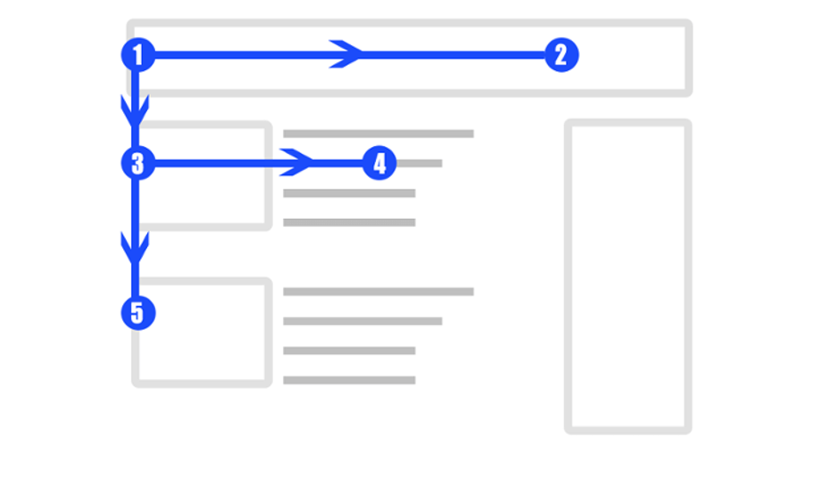

Scrittura e linguaggio
=========================
Un linguaggio semplice è indispensabile per rendere siti e servizi della Pubblica Amministrazione più efficaci e inclusivi. In questa sezione trovi indicazioni pratiche e attività di scrittura e revisione per creare contenuti semplici ed accessibili. 

Come leggono le persone sul web
------------------------------------

Le persone leggono sul web in modo molto diverso rispetto alla lettura tradizionale su carta. Invece di leggere parola per parola, tendono a **scansionare rapidamente** il testo, cercando informazioni rilevanti in modo efficiente. 

Secondo studi sull'usabilità, come quelli condotti da Jakob Nielsen, l'utente legge meno del 20% delle parole su una pagina web. Gli occhi si soffermano su parti specifiche del testo, piuttosto che seguire una lettura lineare. 

Uno dei modelli di lettura più comuni sul web è l'**F-Pattern**, così chiamato perché il movimento degli occhi segue una forma simile alla lettera "F". Le persone iniziano a leggere dall'alto a sinistra, scansionano una riga orizzontale, poi si spostano in basso, leggono un'altra breve sezione orizzontale e infine scendono lungo il margine sinistro, scansionando verticalmente.

   *Rappresentazione dell'F-Pattern, il flusso di lettura più comune dei contenuti sul web.*

Gli utenti dedicano pochi secondi a una pagina per decidere se proseguire la lettura o abbandonarla. I contenuti devono essere chiari e immediatamente comprensibili, con le informazioni principali ben visibili. Le persone cercano informazioni specifiche, ignorando parti del contenuto che non ritengono rilevanti. Questo le porta a saltare interi paragrafi o sezioni se non rispondono immediatamente alle loro domande o esigenze.

Le regole per un linguaggio semplice
----------------------------------------
Il linguaggio, il tono di voce e la formattazione dei contenuti sono quindi elementi cruciali dell’esperienza utente di un sito o servizio digitale. Una Pubblica Amministrazione che mette le persone al centro sa parlare in modo semplice, chiaro ed empatico. 

.. admonition:: Risorse disponibili

   Nei fondamenti `Linguaggio <https://designers.italia.it/design-system/fondamenti/linguaggio/>`_, `Microtesti <https://designers.italia.it/design-system/fondamenti/microtesti/>`_ e `Tono di voce <https://designers.italia.it/design-system/fondamenti/tono-di-voce/>`_ del design system .italia e nella `Guida al linguaggio della Pubblica Amministrazione <https://docs.italia.it/italia/designers-italia/writing-toolkit/it/bozza/index.html>`_ trovi tutte le indicazioni pratiche per scrivere testi semplici e accessibili.

.. admonition:: deepening
   :class: admonition-deepening display-page

   **Checklist per il linguaggio e i contenuti** 
   
   Fai un controllo della qualità del contenuto basandoti sulle seguenti domande:

   -  Lo scopo della pagina è immediatamente chiaro? (Per approfondire: `Stile di scrittura <https://guida-linguaggio-pubblica-amministrazione.readthedocs.io/it/latest/suggerimenti-di-scrittura/stile-di-scrittura.html>`__)

   -  Le informazioni principali sono immediatamente rintracciabili? (Per approfondire: `Come strutturare il contenuto <https://guida-linguaggio-pubblica-amministrazione.readthedocs.io/it/latest/suggerimenti-di-scrittura/come-strutturare-il-contenuto.html>`__)

   -  Il testo è breve, diviso in paragrafi, in elenchi puntati? (Per approfondire: `Come strutturare il contenuto <https://guida-linguaggio-pubblica-amministrazione.readthedocs.io/it/latest/suggerimenti-di-scrittura/come-strutturare-il-contenuto.html>`__)

   -  Tutte le frasi sono chiare, in un linguaggio semplice e lineare? (Per approfondire: `Stile di scrittura <https://guida-linguaggio-pubblica-amministrazione.readthedocs.io/it/latest/suggerimenti-di-scrittura/stile-di-scrittura.html>`__)

   -  Hai fatto uso di termini burocratici, gergali, tecnici o acronimi? (Per approfondire: `Accessibilità e inclusione <https://guida-linguaggio-pubblica-amministrazione.readthedocs.io/it/latest/suggerimenti-di-scrittura/accessibilita-e-inclusione.html>`__)

   -  Hai usato il giusto tono di voce (formale, informale, tecnico, incoraggiante, umano,ecc) per parlare agli utenti? (Per approfondire: `Tono di voce <https://guida-linguaggio-pubblica-amministrazione.readthedocs.io/it/latest/tono-di-voce.html>`__)

   -  Il contenuto è *responsive*? Tutti i contenuti sono efficaci su *mobile*? (Per approfondire: `Stile di scrittura <https://guida-linguaggio-pubblica-amministrazione.readthedocs.io/it/latest/suggerimenti-di-scrittura/stile-di-scrittura.html>`__)

   -  Il testo, le immagini e le interfacce sono accessibili? (Per approfondire: `Accessibilità e inclusione <https://guida-linguaggio-pubblica-amministrazione.readthedocs.io/it/latest/suggerimenti-di-scrittura/accessibilita-e-inclusione.html>`__)

   -  Hai utilizzato parole o termini discriminatori? (Per approfondire: `Accessibilità e inclusione <https://guida-linguaggio-pubblica-amministrazione.readthedocs.io/it/latest/suggerimenti-di-scrittura/accessibilita-e-inclusione.html>`__)

   -  Hai curato i titoli, il sommario, le parole chiave, i metadati? (Per approfondire: `Scrivere per i motori di ricerca <https://guida-linguaggio-pubblica-amministrazione.readthedocs.io/it/latest/suggerimenti-di-scrittura/scrivere-per-i-motori-di-ricerca.html>`__)

   -  Tutti i contenuti sono aggiornati? (Per approfondire: `Gestione dei contenuti <https://guida-linguaggio-pubblica-amministrazione.readthedocs.io/it/latest/suggerimenti-di-scrittura/gestione-dei-contenuti.html>`__)

   -  Sono chiare le azioni che si compiono attraverso le interfacce, le etichette di navigazione, i link? (Per approfondire: `Come strutturare il contenuto <https://guida-linguaggio-pubblica-amministrazione.readthedocs.io/it/latest/suggerimenti-di-scrittura/come-strutturare-il-contenuto.html>`__)

   -  Hai inserito i riferimenti normativi nelle note invece che nel testo? (Per approfondire: `Come strutturare il contenuto <https://guida-linguaggio-pubblica-amministrazione.readthedocs.io/it/latest/suggerimenti-di-scrittura/come-strutturare-il-contenuto.html>`__)

   -  Se hai pubblicato dei **documenti allegati**, hai precisato il formato (es. pdf), il peso, il titolo e una breve descrizione del contenuto? (Per approfondire: `Come strutturare il contenuto <https://guida-linguaggio-pubblica-amministrazione.readthedocs.io/it/latest/suggerimenti-di-scrittura/come-strutturare-il-contenuto.html>`__)

Microtesti
--------------

I microtesti che accompagnano e descrivono gli elementi grafici delle interfacce di un sistema web, sono definiti in gergo tecnico microcopy. L’armonia e la pertinenza fra elementi grafici delle interfacce e microtesti contribuisce a garantire all’utente un usabilità ottimale del sistema. Per questa ragione, è importante verificare periodicamente l’efficacia delle etichette di navigazione attraverso test di usabilità o mediante degli A/B test. Per esempio, un tema da gestire in modo corretto a livello di microtesti è quello dei messaggi di errore. In questo ambito infatti, un buon uso dei testi consente all’utente di capire rapidamente la tipologia di errore, ridurre l’incertezza sull’affidabilità del sistema e in molti casi limitare la necessità di accesso ai canali di assistenza.

.. admonition:: Risorse disponibili

   Approfondisci i vari tipi di microtesti nel capitolo sulla progettazione dell’interfaccia (**LINK A CAPITOLO**) e trova indicazioni pratiche per la loro progettazione nel `fondamento Microtesti <https://designers.italia.it/design-system/fondamenti/microtesti/>`_ del design system .italia.

.. admonition:: deepening
   :class: admonition-deepening display-page

   **I testi come interfacce**

   Le etichette di navigazione
   ---------------------------
   
   Una *label* (o etichetta) è un breve testo o un’icona che indica un
   insieme di contenuti con caratteristiche comuni: attraverso le etichette
   l’utente si orienta nell’ambiente facendosi un’idea
   dell’organizzazione e del sistema di navigazione. Le etichette dovrebbero
   guidare gli utenti nei nuovi concetti e aiutarli a
   identificare quelli già familiari con facilità.

   **Le label sono un sistema** che guadagna solidità dalla coerenza dei
   suoi elementi: per questo non si progettano singole label, ma sistemi
   di label. Nel progettare un *labeling system* è importante tenere
   conto:

   -  delle `buone pratiche su linguaggio e composizione dei
      contenuti <https://guida-linguaggio-pubblica-amministrazione.readthedocs.io/it/latest/suggerimenti-di-scrittura.html>`__;

   -  delle pratiche di organizzazione dei contenuti dal punto di vista
      dell’architettura dell’informazione (**LINK A CAPITOLO**);

   -  dell’ottimizzazione dei contenuti in ottica SEO (**LINK A CAPITOLO**).

   Lavorare sulla coerenza del sistema richiede grande attenzione:
   alcuni elementi possono influenzarne la solidità. Di seguito trovi
   una checklist per verificare l’uniformità di alcuni elementi che – se
   incoerenti – possono rischiare di rendere ambiguo il *labeling system*.

   -  **Stile e ortografia:** verifica, per esempio, l’uniformità delle
      varianti “CHI SIAMO”, “Chi siamo”, “Chi Siamo”.

   -  **Formattazione**: dimensioni e colore dei caratteri, spaziature,
      sfondi possono rinforzare la coerenza di un sistema di etichette.

   -  **Sintassi:** evita di avere nello stesso sistema label a base
      verbale (“Scarica il documento”), nominale (“Documenti
      scaricabili”) e domande (“Devi scaricare il documento?”). Scegli
      un approccio sintattico e mantienilo.

   -  **Livello di granularità:** all’interno del sistema è meglio avere
      etichette di pari livello di specificità. “Modulo per la richiesta di
      cambio di residenza” accanto ad “Anagrafe”, esposto nella stessa
      area del sito e allo stesso livello, genererebbe confusione.

   -  **Completezza:** l’assenza evidente di una voce nel sistema di
      etichette potrebbe confondere l’utente. Per esempio: la mancanza
      della voce “Anagrafe” sul sito di un Comune potrebbe far pensare a
      un errore e di conseguenza l’incertezza per l’utente nel capire
      come muoversi nell’ambiente.

   -  **Utente di riferimento:** tieni sempre presenti i bisogni emersi
      dalla ricerca sugli utenti, in modo che il sistema sia il
      meno ambiguo possibile.

   La **ricerca sugli utenti** può fornire utili risposte per la
   progettazione del *labeling system*. I metodi diretti sono `il card
   sorting <https://designers.italia.it/risorse-per-progettare/progettare/architettura-dell-informazione/organizza-i-contenuti/>`__
   e il *free listing*; quelli indiretti – che forniscono dati
   quantitativi più grezzi e da rielaborare – sono la ricerca interna ed
   esterna al sito, con strumenti come `web
   analytics <https://designers.italia.it/kit/analytics/>`__ e
   `Google Search Console <./seo.html#webmaster-tools-search-console-di-google>`_.

Scrittura collaborativa 
------------------------------

La scrittura collaborativa, in inglese pair writing, consiste nello scrivere insieme a un’altra persona, allo stesso tempo davanti al computer o un foglio di carta.  

L’altra persona, in base alle esigenze del progetto e la natura del contenuto che si sta scrivendo, può essere un altro designer o qualsiasi persona che ha una conoscenza approfondita del tema. 

È un’ottima modalità di scrittura per creare velocemente contenuti senza dover creare e modificare numerose bozze o attendere lunghi cicli di approvazione. 

Può essere difficile per una sola persona scrivere contenuti che sono sia corretti e sia facili da leggere. In ogni istituzione ci sono esperti di determinati argomenti che possono scrivere in maniera accurata. Tuttavia, non sono sempre in grado di spiegare un argomento in maniera semplice e chiara, proprio perché ne sanno troppo e la loro mente si focalizza sui dettagli. La scrittura collaborativa serve quindi a scrivere testi corretti, ma anche semplici da comprendere.

.. admonition:: Risorse disponibili

   All’interno del `kit Contenuti e linguaggio <https://designers.italia.it/kit/content-kit/>`_ puoi trovare un `esercizio di editing collaborativo <https://designers.italia.it/risorse-per-progettare/progettare/contenuti-e-linguaggio/crea-il-linguaggio-del-touchpoint-digitale/>`_ che ti mostra in che modo utilizzare:

    -  degli strumenti come `InVision <https://www.invisionapp.com/>`__ e `Hypothes.is <https://web.hypothes.is/>`__, che ti permettono di fare una revisione dei contenuti direttamente nel loro contesto d’uso, online (nel caso di contenuti già pubblicati) oppure in un prototipo (nel caso di nuovi contenuti). Questo approccio è particolarmente utile per analizzare e migliorare *label*, voci di menu e testi che accompagnanano le interfacce grafiche attraverso cui si fruisce un servizio;

    -  degli strumenti di scrittura collaborativa come `Google Docs <https://docs.google.com/document/u/0/>`__, che ti permettono di fare interventi condivisi sulle parti testuali del tuo contenuto.

Content critique
--------------------

Le content critique, spesso abbreviato in *crit*, sono sessioni collaborative di valutazione e feedback su contenuti in fase di sviluppo. L'obiettivo di queste sessioni è quello di migliorare la qualità del contenuto, basandosi su un’analisi critica costruttiva e sui suggerimenti di più persone. 

Durante le sessioni, si verifica l’accuratezza fattuale e se il tono, lo stile e la struttura siano adatti al target e agli scopi. 

Le content critique sono molto utili, perché: 

- permettono di individuare aree di miglioramento che il singolo autore potrebbe non notare; 
- ogni partecipante porta una visione e una sensibilità differente, il che arricchisce il processo di revisione. Questo aiuta a creare contenuti che siano rilevanti per un pubblico più ampio e che rispondano a diverse esigenze o domande;
- partecipare alle content crits aiuta i membri del team a migliorare le proprie competenze di scrittura, revisione e feedback. 

.. admonition:: deepening
   :class: admonition-deepening display-page

   **Come svolgere una content critique**

   1. **Preparazione del contenuto**: Presenta una bozza o una versione preliminare da sottoporre a revisione. Non è necessario che sia perfetta, ma deve essere abbastanza sviluppata da permettere una critica utile e costruttiva.
   2. **Selezione dei partecipanti**: Il gruppo ideale per una dovrebbe includere persone con competenze diversificate, in moco da avere punti di vista diversi. 
   3. **Fornire il contesto**: Prima di iniziare, spiega il contesto del contenuto: il pubblico target, l’obiettivo del pezzo, il tono desiderato ed eventuali vincoli specifici. Questo aiuta i partecipanti a dare un feedback più mirato.
   4. **Strutturare la critica**: Il focus deve essere sulla costruzione e sul miglioramento, non sulla critica fine a sé stessa. I partecipanti dovrebbero indicare cosa funziona e cosa non funziona, offrendo soluzioni o suggerimenti concreti. Puoi stimolare questi tipi di riflessione tramite domande aperte, come “Pensi che questo tono sia adatto per l’utente finale?” o “C'è un modo più semplice per comunicare questo concetto?” 
   5. **Ascolto attivo e rispetto**: Sii aperto al feedback e non prendere le critiche in modo personale. Mantieni un tono rispettoso e orientato al miglioramento. 
   6. **Documentare i feedback**: Prendi appunti durante la sessione o utilizzare strumenti collaborativi come Google Docs o software di project management per raccogliere e organizzare il feedback.
   7. **Follow-up**: Dopo la sessione, rivedi il contenuto alla luce del feedback ricevuto e, se necessario, programma una nuova sessione per verificare i miglioramenti apportati. 

Traduzione e localizzazione dei contenuti
--------------------------------------------
Localizzare (rendere disponibile in più lingue) un sito o servizio digitale può essere molto importante per renderlo più efficace per tutti gli utenti, anche quelli che non conoscono o non hanno dimestichezza con la lingua e la cultura italiane.  

Questo passaggio può essere particolarmente importante per i servizi pubblici, che si rivolgono spesso anche a cittadini di altre nazionalità, apolidi o a cittadini italiani ma che hanno diversi riferimenti linguistici o culturali.  

Sono state identificate come prioritarie le seguenti lingue straniere: **tedesco**, **sloveno**, **francese** e **inglese**.

Quando si procede alla traduzione di un sito o di un servizio, la prima scelta da fare è se: 

- tradurre l’intero sito (o l’intero servizio/applicazione); 
- tradurne solo una parte, dove l’utilizzo di altre lingue è particolarmente rilevante (es. la sezione “visti” del sito del Ministero degli esteri, la sezione dedicata alle emergenze del sito di un ospedale, ecc.).

La scelta va fatta in considerazione: 

- di una ricerca sugli utenti del sito o del servizio, che indaghi la lingua e i riferimenti culturali attraverso strumenti quantitativi (`web analytics <https://designers.italia.it/risorse-per-progettare/validare/web-analytics/>`_) e qualitativi (`interviste utente <https://designers.italia.it/risorse-per-progettare/comprendere/interviste-soggetti-coinvolti/>`_, ad esempio); 
- degli obiettivi che si vogliono perseguire con i propri contenuti (inclusione, efficienza del servizio, accessibilità, ecc.).

Per la creazione e la gestione di una versione multilingua di un sito è necessario organizzare un flusso di lavoro che preveda: 

- la mappatura di tutti i contenuti; 
- la scelta dei contenuti da tradurre, in base agli utenti e agli obiettivi da raggiungere; 
- l’organizzazione all’interno del team del lavoro di traduzione e localizzazione dei contenuti; 
- il test dell’efficacia dei contenuti tradotti (tramite `A/B test <https://medium.com/designers-italia/la-b-testing-a-supporto-della-user-experience-aec73bc0fbb>`_, `test di usabilità <https://designers.italia.it/risorse-per-progettare/validare/test-di-usabilita/>`_).

Se la traduzione riguarda solo alcune parti del sito: 

- mostra in modo evidente l’interfaccia per scegliere la lingua alternativa; 
- assicurati di tradurre anche il contesto, aggiungendo dei chiarimenti quando necessario, per non lasciare le informazioni isolate o dare per scontate altre informazioni che non sono tradotte.

“Tradurre” i contenuti di un sito o di una sezione di un sito non significa limitarsi a cambiare il testo dall’italiano alla lingua di destinazione, ma anche “localizzare” i contenuti, rendendoli comprensibili ed efficaci anche da chi parla un’altra lingua o ha una diversa cultura. Ad esempio: 

- alcuni concetti o nomi possono non essere immediatamente comprensibili per un turista o un cittadino di altra nazionalità e vanno spiegati, oltre che tradotti (ad esempio, “il medico di base”, “gli esami di stato”, “l’Inps”, “l’Agenzia delle entrate”, ecc.); 
- alcune espressioni possono avere un significato diverso se semplicemente tradotte in un’altra lingua (ad esempio, “timbra il biglietto” si potrebbe tradurre con “validate your ticket by stamping it at the machines” invece che con un semplice “stamp your ticket”); 
- può essere necessario adattare alcuni contenuti in base alla cultura di chi legge (i concetti di “famiglia” e “congiunti”, ad esempio, potrebbero avere significati diversi e quindi in alcuni casi andare chiariti in base ai riferimenti culturali degli utenti a cui ci si rivolge). 

In generale, si ritiene preferibile assegnare l’attività di traduzione ad **agenzie certificate ed esperte nella traduzione per le comunità di lingua minoritaria**, che assicurino il rispetto delle specificità linguistiche locali. Inoltre, quando possibile, si consiglia la consulenza di un esperto di localizzazione UX, per assicurare non la semplice traduzione testuale dei microtesti, ma il corretto adattamento degli aspetti di interazione delle interfacce alle convenzioni culturali della lingua di destinazione (per esempio, è necessario sapere che i pulsanti - le call to action vogliono il verbo all’infinito in lingua francese: “Scopri” diventa "Découvrir").

.. admonition:: deepening
   :class: admonition-deepening display-page

   **Materiali da formire a un’agenzia di traduzione**

   Quando si forniscono all’agenzia di traduzione i testi definitivi in lingua italiana, accompagnare il pacchetto di contenuti da tradurre con una serie di risorse tra cui: 

   - gli screenshot delle interfacce in italiano, in cui i testi in lingua straniera dovranno essere inseriti. Si consiglia di fornire, quando possibile in base agli strumenti condivisi a disposizione, non solo le interfacce slegate, ma le interfacce inserite nel flusso del servizio; 

   - l’indicazione per ogni contenuto (con particolare attenzione ai microtesti) del numero massimo di caratteri utilizzabili, per rispettare gli spazi in cui il testo sarà inserito;  

   - indicazioni di formattazione (ad esempio, uso del grassetto);

   - un documento riassuntivo che descriva il contesto d’uso del servizio da tradurre, che comprenda: (1) obiettivi del servizio e scenari d’uso, (2) il target del servizio, (3) indicazioni sul tono di voce che si è seguito nella scrittura dei contenuti in italiano, (4) indicazioni di cui tenere conto per la localizzazione UX nelle diverse lingue di destinazione, (5) eventuali reference di siti in lingua per fare benchmark rispetto alle localizzazioni su temi/linguaggi specifici. 

.. important::

   Se hai un sito multilingue, ricordati che quando aggiorni o cambi i contenuti dovrai farlo contemporaneamente su più lingue, mantenendo allineata la versione italiana con le altre lingue. 

